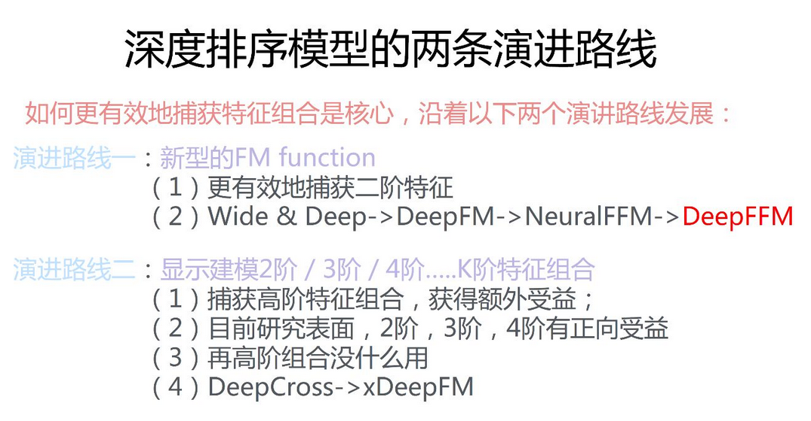

# 推荐系统
## 基础算法
* 基于物品的协同过滤： *itemCF.py*  
* 隐语义模型： *LFM.py*   
* 统计词频的算法：*TF_IDF.py* 

itemCF和LFM都在movieLens数据集上测试，结果如下：   

| algorithm | precision | recall | coverage |
| :-------: | :-------: | :----: | :------: |
|  itemCF   |  0.1888   | 0.2280 |  0.4078  |
|    LFM    |  0.0849   | 0.1051 |  0.1513  |

## DNN相关
* 概括起来两种结构类型：串行和并行   
  对DNN-based的综述博文：https://zhuanlan.zhihu.com/p/67795161  
  
* 最经典wide & deep：Wide部分有利于增强模型的“记忆能力”，Deep部分有利于增强模型的“泛化能力”  
  参考阅读：[见微知著：你真的搞懂wide & depp模型了吗](https://zhuanlan.zhihu.com/p/142958834)
* DeepFM：把wide部分用FM层替换

## 大文件
data/ml-1m文件夹下有多个大文件，使用Git lfs无效后上传至百度网盘  
* itemCF.py中的co_matrix.csv、item_sim.dict, [戳这里](https://pan.baidu.com/s/1EfFRFIGLStFyOgNa50VK8Q)，提取码：7l39  
* LFM.py训练好的lfm.model、R_dict.dict, [戳这里](https://pan.baidu.com/s/1RxU0iBf8P86j5NEC4idfog)，提取码：9wl2  